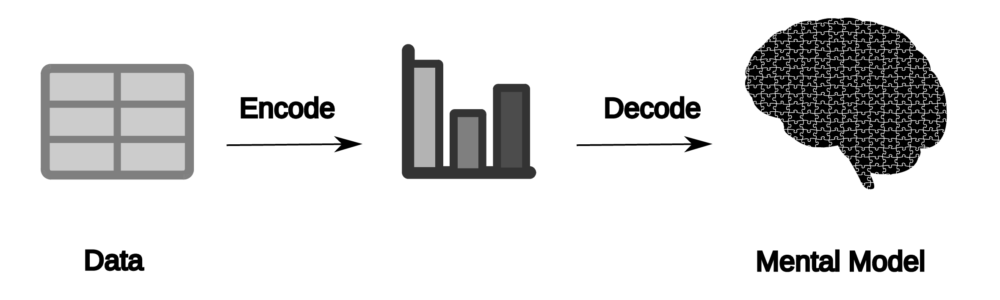
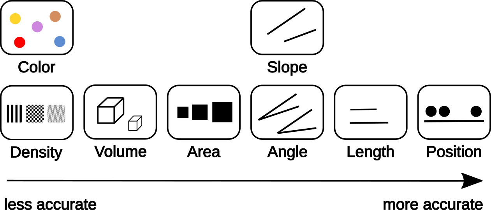

# Introduction to data visualisation

## Perception - the five senses

The five senses are the primary means by which humans perceive and
experience their environment. They include sight, hearing, smell,
taste, and touch. Sight is the ability to see objects and colors
through light waves that enter our eyes and stimulate specialized
cells called rods and cones in the retina. Hearing involves the
perception of sound by detecting vibrations in the air using hair-like
structures called cilia in the inner ear. Smell is the ability to
perceive odors through a network of olfactory receptors that detect
chemical compounds present in scents. Taste is the sensation of flavor
and texture, which involves the interaction between taste buds on our
tongue and various molecules present in food or drink. Touch is the
perception of pressure, temperature, and other tactile stimuli through
a network of nerve endings that detect these signals from our skin and
muscles. Together, these five senses enable humans to interact with
their environment, learn about it, and adapt to different situations
and experiences.

- sight (stimulus: light)
- smell (stimulus: chemical substance)
- touch (stimulus: presure / temperatur)
- taste (stimulus: chemical substance)
- hearing (stimulus: sound = presure)

## Encoding / decoding of data during visualisation

**Data encoding** refers to the process of representing numerical or
categorical information in a way that can be easily understood by
humans through visual means such as graphs, charts, or maps. During
data visualization, this encoded information is translated into
different types of visual representations like line plots, bar charts,
scatter plots, and pie charts, among others.

**Data decoding** refers to the process of interpreting these visual
representations to extract meaningful insights from the data. This
involves understanding how the various elements within a graph or
chart are related and what patterns they may reveal about the
underlying data. It helps forming a mental model of the visualised
data.

<figure id="fig:Encoding" width="800">

<figcaption>Encoding and decoding during visualisation to form a mental model</figcaption>
</figure>

### Features / Attributes

Features can be
- **categorical** / **qualitative**
  - **Nominal**: Nominal features are categorical variables that have
    two or more categories without any inherent order or ranking among
    them. (e.g. eye color, type of bike)
  - **Ordinal**: These are features that represent a natural order. The
    values can be ordered but not necessarily equally
    spaced. (e.g. very bad, bad, good, very good)
- **numerical** / **quantitative**
  - **Discrete**: Discrete features are a type of variable in
    statistics and data analysis that represent countable, distinct
    values. (e.g. number of people, number of page visits per month)
  - **Continuous**: These are features that represent numerical data with
    infinite possibilities and can take any value within a range
    (e.g. height of person, weight of ships, distance between two
    locations)

## Aesthetics

Aesthetics - anciet greek αἴσθησις;

In the context of data visualization, aesthetics refer to the visual
properties and attributes used to represent data. Aesthetics play a
crucial role in making visualizations engaging, understandable, and
informative.

<figure id="fig:accuarcy" width="800">

<figcaption>based on Mackinlay, 1986, <em>ACM Transactions on
Graphics</em>, <a
href="https://doi.org/10.1145/22949.22950">https://doi.org/10.1145/22949.22950</a></figcaption>
</figure>

## Misc

<figure id="fig:accuarcy" width="800">

<figcaption>Shape vs Color</figcaption>
</figure>
